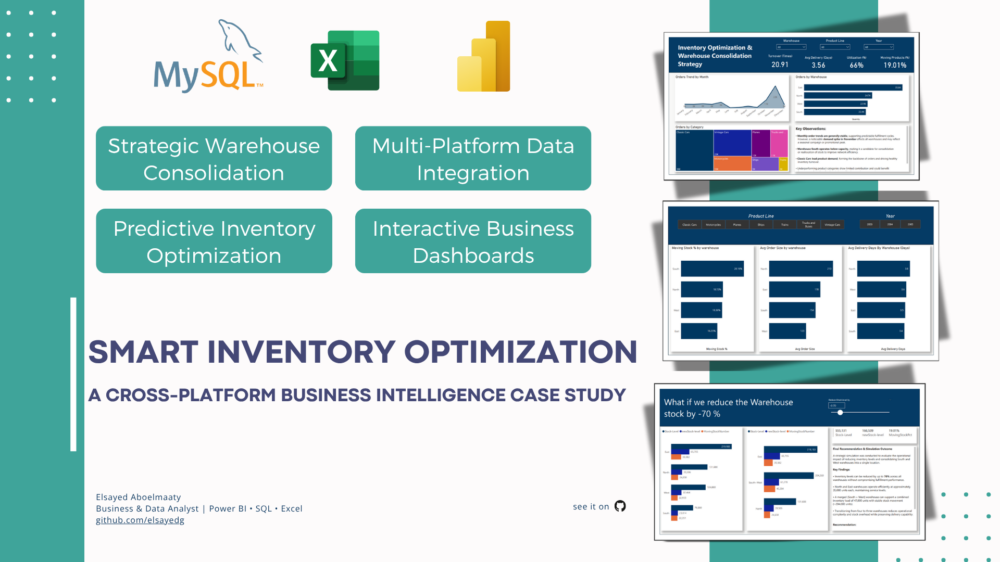

# Mint Classic Cars – Data-Driven Inventory Optimization

**Harnessing the power of data to optimize warehouse storage and streamline operations.**

  

This project explores how Mint Classics, a fictional model car retailer, can optimize inventory and warehouse operations through SQL-based analysis, Excel visualizations, Power BI dashboards, and scenario simulation.

---

## 🌟 Project Summary
This end-to-end analytics project demonstrates how data from a relational database can be used to identify inefficiencies in warehouse inventory, simulate reduction strategies, and recommend structural changes such as warehouse consolidation. Power BI is used to deliver an interactive visual dashboard and business recommendations.

---

## 🎯 Project Objectives
- Explore current inventory composition and trends across four warehouses
- Determine critical KPIs: delivery time, moving stock %, utilization
- Simulate 50% to 70% inventory reduction through what-if analysis
- Recommend cost-effective operational improvements, including consolidation of underperforming warehouses

---

## 📊 Key Analysis Steps

### 1. Exploratory Data Analysis (SQL + Excel)
- Product counts by warehouse
- Items served per location
- % of moving stock (annual)
- Average delivery times
- Outlier and early delivery investigation
- Product categories/subcategories analysis
- Regional customer distribution

### 2. Data Visualization (Excel + Power BI)
- Excel used for quick pivots and static visuals
- Power BI used for:
  - Interactive monthly order trends
  - Orders by warehouse (volume and movement)
  - Product category contributions via treemaps
  - Warehouse-specific KPIs (delivery time, order size)
  - What-if slider for stock reduction scenarios

### 3. Targeted Insights (via Power BI and SQL)
- South and West warehouses are underutilized
- Inventory levels can be reduced by up to 70% with no service impact
- Merging South + West provides operational efficiency and reduces complexity

---

## ✅ Final Recommendation
- Consolidate the inventory of Warehouse D with Warehouse C (Power BI analysis: South + West)
- Maintain ~35K stock levels in North and East
- Use what-if simulation to validate 70% inventory reduction feasibility
- Proceed with cost-benefit validation and phased rollout of new warehouse configuration

---

## 🛠️ Tools & Technologies
- **SQL** (MySQL Workbench): data extraction, joins, aggregations
- **Excel**: data cleaning, EDA, pivot charts
- **Power BI**: dashboard development, what-if analysis, KPIs

---

## 📁 Files Included

- `1-Data/` — Cleaned datasets used across all tools (Excel, SQL, Power BI)
- `2-SQL/` — SQL scripts used for initial data exploration and analysis
- `3-Excel/` — Excel workbook with pivot tables and visual breakdowns
- `4-PowerBI/` — Power BI project file (`.pbix`) with full dashboard (4 pages)
- `img/` — Project visuals and screenshots

## 📄 Key Documents

- `Mint_Inventory_Case_Summary.pdf` — One-page business summary with key findings and recommendation
- `Mint_Inventory_Optimization_ElsayedAboelmaaty.pdf` — Final Power BI dashboard report (with cover page and all visuals)

---

## 👨‍💼 Audience
- Data analysts and BI professionals
- Operations and warehouse managers
- Recruiters and hiring managers assessing dashboarding & analytics skills
- Business leaders exploring inventory optimization through data

---

**Created by:** Elsayed Aboelmaaty  
**Role:** Business Operations & Data Analyst  
**Date:** July 2025

